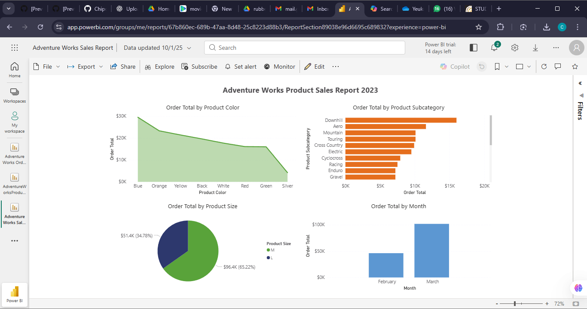

Adventure Works Product Sales Report 2023

This project features an interactive Power BI dashboard analyzing product sales trends for the Adventure Works dataset.
It explores how product color, size, subcategory, and monthly trends contribute to overall sales performance.

🖼️ Preview

📊 Dashboard Insights

This dashboard provides a breakdown of:
Order Total by Product Color — line/area chart showing which colors drive the most sales
Order Total by Product Subcategory — bar chart comparing sales across bike subcategories
Order Total by Product Size (M vs L) — pie chart showing size-based contribution
Order Total by Month — monthly trend visualization for quick comparison

🧰 Tools Used

Microsoft Power BI
Power Query for ETL
Visual analytics using bar charts, line charts, pie charts

📁 Files Included

Adventure_Works_Sales_Report.pbix — Power BI file
Adventure_Works_Sales_Report.png — final report screenshot

✨ Description

This report helps analyze how different product attributes—such as color, subcategory, and size—affect total sales.
It was created as part of the Microsoft Power BI Professional Certificate practice exercises and demonstrates:
Data storytelling
Trend analysis
Business-focused visualization
Clean report design
